# API de Usuários

## 1. Identificação

- **Aluna:** Luiza Vittória Cardoso
- **Curso:** Informática
- **Unidade Curricular:** Desenvolver Serviços Web

## 2. Como instalar as dependências


1. Instale o [PHP](https://www.php.net/) e o [Composer](https://getcomposer.org/).

2. Na pasta raiz do projeto a pasta que contém `composer.json` — instale as dependências:

   ```bash
   composer install
   ```

3. Inicie o servidor de desenvolvimento embutido do PHP:

   ```bash
   php -S localhost:8080 -t usuario
   ```

4. A API ficará disponível em `http://localhost:8080`.

## 3. Decisões técnicas

- Foi utilizado o **Slim Framework 4** para definir e atender às rotas HTTP da API.

- As mensagens de resposta são serializadas em JSON e enviadas com o cabeçalho `Content-Type: application/json`.

- Os usuários são armazenados em um array em memória para simplificar a demonstração. Assim os dados adicionados ou alterados não permanecem e nem são reiniciados quando a aplicação reinicia.

- A API monstra operações de consulta, filtro, criação, atualização e remoção de usuários por meio dos métodos GET, POST, PUT e DELETE.

- Erros de usuário não encontrado retornam status HTTP 404; a criação retorna 201; e as operações bem-sucedidas retornam 200, exceto a criação.


### Rotas disponíveis

| Método | Rota | Descrição |
|---|---|---|
| GET | `/status` | Verifica se a API está ativa. |
| GET | `/usuarios` | Lista os usuários; aceita o parâmetro opcional `nome` para filtrar. |
| GET | `/usuarios/{id}` | Consulta um usuário pelo identificador. |
| POST | `/usuarios` | Cadastra um usuário. |
| PUT | `/usuarios/{id}` | Atualiza nome, e-mail e login de um usuário. |
| PUT | `/usuarios/{id}/senha` | Atualiza a senha de um usuário. |
| DELETE | `/usuarios/{id}` | Remove um usuário. |

Para criar um usuário, envie um corpo JSON com os campos `nome`, `email`, `login` e `senha`.

## 4. Prints

//status
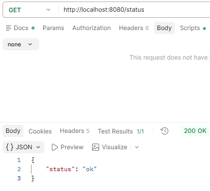

//Id 1
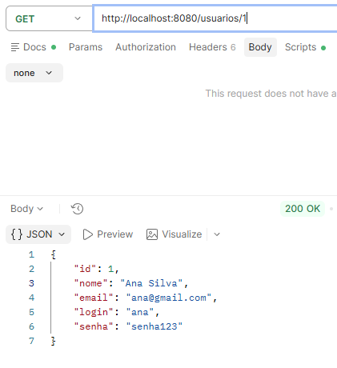

//id 2
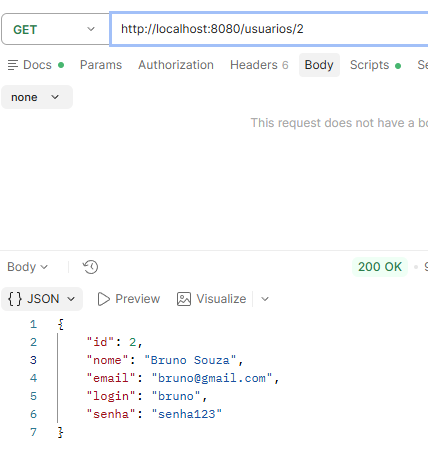

//id 3
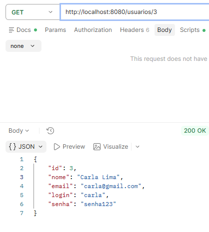

//id 4
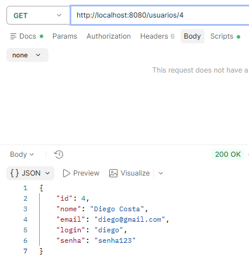

//id 5
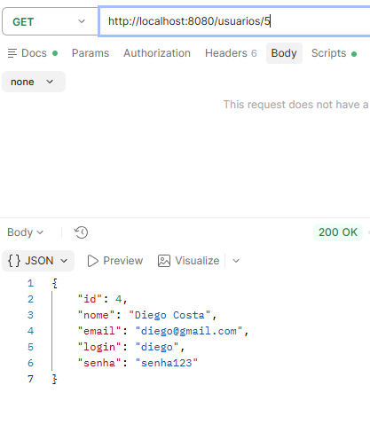

//Sem Filtro
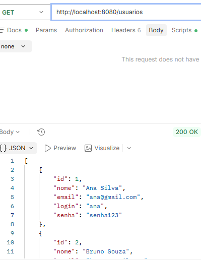

//Post
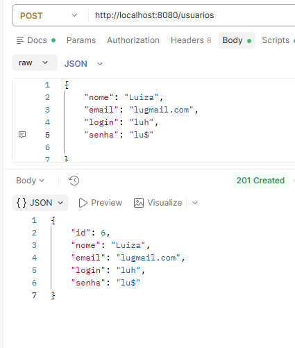

//Put 1
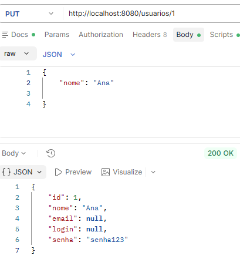

//Put 2
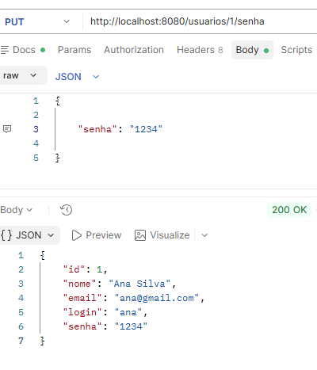

//Delete
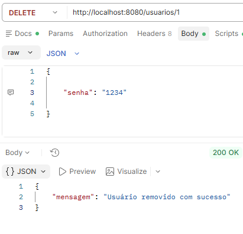